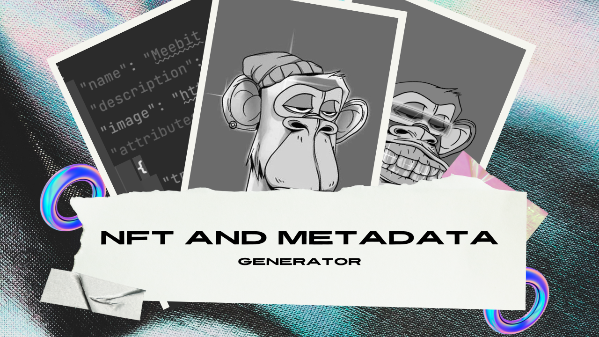

<div align="center">
    <h1>NFT Generator</h1>
    <h3>🎆 A simple unique Metadata & NFT images generator script with custom 
probabilities.</h3>
</div>

<br>

<div align="center">
	| 
    <a href="https://vusal.substack.com">blog</a> | 
    <a href="https://gist.github.com/woosal1337">gist</a> | 
    <a href="https://github.com/woosal1337/dotfiles">dotfiles</a> |  
    <a href="https://www.reddit.com/user/woosal1337">reddit</a> | 
    <a href="https://keybase.io/woosal">keybase</a> | 
    <a href="https://t.me/woosal1337">telegram</a> |
    <a href="https://twitter.com/woosal1337">twitter</a> | 
    <a href="https://www.instagram.com/woosal1337/">instagram</a> |
    <a href="https://open.spotify.com/user/3pd70lv4jpyjbjxjfgysx3pzl">spotify</a> |
    <a href="https://discordapp.com/users/901937888688758785">discord</a> |
    <a href="mailto:woosal@pm.me">mail</a> |
</div>

# Contents
- [1. Introduction](#introduction)
- [2. Features](#features)
- [3. Setup](#setup)
- [4. Usage](#usage)
- [5. License](#license)

# Introduction
This is a custom NFT generator script that generates unique images with custom probabilities. 
It's a simple script that can be used to generate NFT images for your project. Follow the setup and usage instructions to get started.
A UI version of this script will be available soon.

Project structure:
```zsh
├── LICENSE
├── README.md
├── app
│   ├── __init__.py
│   ├── images
│   │   └── __init__.py
│   ├── launcher.py
│   ├── metadata
│   │   └── __init__.py
│   ├── metadata_generator.py
│   ├── nft_generator.py
│   ├── nfts
│   │   └── __init__.py
│   ├── rarity.json
│   └── requirements.txt
├── docs
│   ├── README.md
│   ├── __init__.py
│   ├── metadata_structure_example.json
│   └── rarity_structure_example.json
├── pre-commit-config.yaml
├── requirements.txt
└── tests
    └── __init__.py
```

# Features
- [X] Generate Metadata JSON files and save them automatically.
- [X] Generate NFT images with custom probabilities and save them automatically.
- [X] Check the possibilities and get informed if the requested numbers match the 
  probabilities.
- [X] Completely customizable project name, file extension, project description, NFT 
  numbering, etc.

# Setup
1. Environment setup:
- The current code was run on Python 3.11.0, but it should work on Python 3.8+. Make 
  sure to create a virtual environment and install the required packages.
```zsh
$ python3 -m venv venv
$ source venv/bin/activate
$ pip install -r requirements.txt
```

2. Requirements:
- Put all of your images in the `app/images` folder. The images should be named the 
  same as the trait names in the `rarity.json` file. For example, if you have a trait named 
  as `Golden` in the `rarity.json` file, you should have a `Golden.png` image in the 
  trait folders. Any name mismatch will cause the script to fail.
- The folder names in `app/images` should be renamed to the trait category names in the 
  `rarity.json` file. For example, if you have a trait category named as 
  `Background` or `Skin` etc. in `rarity.json`, you should have a `Background` folder in
  the `app/images` folder as well. Any name mismatch will cause the script to fail.
- All of the images in the `app/images` folder should be the same size. Any size mismatch 
  will NOT cause the script to fail, however, final images will be distorted.
- `rarity.json` file should be in the `app` folder. The structure of the file is 
  explained in the [docs](docs/README.md) folder, `README.md` file.
- Finally when running the `launcher.py` to generate all of the NFTs, make sure to 
  be in the correct directory and the path, which is:
```zsh
$ cd app/
$ pwd

> nft-and-metadata-generator/app/
```

3. Streamlit GUI Setup and Usage:
```zsh
$ pip install -r requirements.txt
$ cd app/

$ pwd

> nft-and-metadata-generator/app/

$ streamlit run streamlit_gui_generator.py

>  You can now view your Streamlit app in your browser.

>  Local URL: http://localhost:8501
>  Network URL: http://192.168.1.114:8501
```

### Streamlit Video Guide:
[](https://www.youtube.com/watch?v=QSAhQx4UHlw)

# Usage
- To generate all of the NFTs, run the `launcher.py` file after modifying `rarity.
  json` and putting all of the necessary images in the `app/images` folder. Make 
  sure to read #Setup section before running the script:
```zsh
$ python3 -m venv venv
$ source venv/bin/activate

$ python launcher.py
```
- According to the number of NFTs you want to generate, the script will generate 
  the NFTs and save them in the `app/nfts` folder. It will also generate the 
  metadata JSON files and save them in the `app/metadata` folder. It might take some 
  time to generate all of the NFTs, so be patient. You can follow the progress 
  throughout the logs.

# License
- [MIT](LICENSE)
